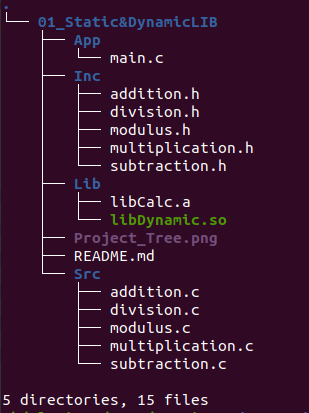

# Generating Output Using Source Files or Static & Dynamic Librarys 

This project demonstrates how to generate output by compiling and linking source files or by using static & dynamic library.

## Project Tree

## Using Source Files:

### 1. Compile all source files into executable file:
    gcc App/main.c Src/* -o Calc

### 2. Run the executable:
    ./Calc

## Using Static Library:

### 1. Compile all source files into object files:
    cd Lib/
    gcc ../Src/* -c .

### 2. Generate static library from object files:
    ar rcs libCalc.a ./*

### 3. Link the static library with the main file to generate the output:
    cd ..
    gcc App/main.c Lib/libCalc.a -o Calc
    
### 4. Run the executable:
    ./Calc    

## Using Dynamic Library:

### 1. Compile all source files into executable file:
  **Position-independent code(fPIC):** this flag is needed to make sure when the library is loaded in runtime, it is loaded at a specific address to be known by the application.  
  
    cd Lib/
    gcc ../Src/* -fPIC -c .

### 2. Generate dynamic library from object files:
  **Note:** the generated .so file is an executable as it will be executed by the **system loader** at run-time.
  
    gcc -shared *.o -o libDynamic.so
    
### 3. Link the dynamic library with the main file to generate the output:
    cd ..
    gcc App/main.c -L./Lib -lDynamic -o Calc

### 4. System loader :
    is a component of the operation system responsible for loading executable programs or shared library. It is invoked when the application launched by user or another program.
#### To run the program, It searches for three specific places:
  a) System loader automatically search for the library in **LD_LIBRARY_PATH**  
  
     cd Lib/
     LD_LIBRARY_PATH=${LD_LIBRARY_PATH}:$PWD

  b) The default search path which is **/usr/lib, /lib32, /usr/lib32** 
  
     cp Lib/libDynamic.so /usr/lib
     
  c) **-Wl,-rpath=./Lib** Option while compiling to tell the linker where to locate the share library at runtime 
  
     gcc App/main.c -Wl,-rpath=./Lib -L./Lib -lDynamic -o CalcDynamic  

**Note:** To know the shared object dependencies for the executable use **ldd**. ( after following a or b or c ->  libDynamic.so => destination)

	linux-vdso.so.1 (0x00007ffc78d66000)
	libDynamic.so => not found
	libc.so.6 => /lib/x86_64-linux-gnu/libc.so.6 (0x00007f67978a6000)
	/lib64/ld-linux-x86-64.so.2 (0x00007f6797adc000)

    
     

    
