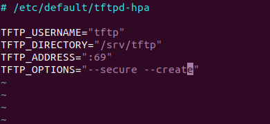

# U-Boot (Das U-Boot)

**U-Boot,** short for Universal Bootloader, is an **open-source bootloader** widely used in embedded systems. It supports a wide range of architectures and platforms, making it a versatile choice for bootstrapping embedded Linux systems and other operating systems.

## Building U-Boot

## 1. Clone the U-Boot repository from the official Git repository and branch to a stable release:
```bash
git clone https://github.com/u-boot/u-boot.git
cd u-boot/
git checkout v2022.07
```
## 2. Configure U-Boot for your target platform ( Vexpress Cortex A9 (Qemu) ):
### 2.1. Grep the machine wanted by using U-Boot configs file( supported machines )
```bash
# In order to find the machine name supported by U-Boot
ls configs/ | grep vexpress
```
### 2.2. Default configured U-Boot for supproted architecture:
```bash
# load the default configuration of ARM Vexpress Cortex A9
make vexpress_ca9x4_defconfig ARCH=arm CROSS_COMPILE=~/x-tools/arm-cortexa9_neon-linux-musleabihf/bin/arm-cortexa9_neon-linux-musleabihf-
```
**Notes**
### Varibles used by the u-boot makefile
```bash
CROSS_COMPILE=<Path To the Compiler>/arm-cortexa9_neon-linux-musleabihf-

ARCH=arm
```
### 2.3. Modify default-configured U-Boot for supproted architecture:
```bash
make menuconfig ARCH=arm CROSS_COMPILE=<Path To the Compiler>/arm-cortexa9_neon-linux-musleabihf-
```
**The requirement are like following**:

- [x] Support **editenv**.
- [x] Support **bootd**.
- [x] Store the environment variable inside file call **uboot.env**.
- [ ] Unset support of **Flash**
- [x] Support **FAT file system**
  - [x] Configure the FAT interface to **mmc**
  - [x] Configure the partition where the fat is store to **0:1**
  
### 2.4. Build U-Boot:
```bash
make ARCH=arm CROSS_COMPILE=<Path To the Compiler>/arm-cortexa9_neon-linux-musleabihf- -j<Number of cores>
```
## 3. Test U-Boot(Run Qemu):
```bash
qemu-system-arm -M vexpress-a9 -m 128M -nographic -kernel <Path To the u-boot>/u-boot -sd <Path To the sd.img>/sd.img
```

## Initialize TFTP protocol 
TFTP (Trivial File Transfer Protocol) is a simple protocol used for transferring files between networked devices. It is commonly used for bootstrapping devices or transferring configuration files in network environments 

### Ubuntu

```bash
#Download tftp protocol
sudo apt-get install tftpd-hpa
#Change the configuration of tftp
sudo vim /etc/default/tftpd-hpa
	#write inside the file
    TFTP_OPTIONS="--secure --create"
#Restart the protocal
Systemctl restart tftpd-hpa
#Make sure the tftp protocol is running
Systemctl status tftpd-hpa
#Change the file owner
cd /srv
sudo chown tftp:tftp tftp 
#Move your image or file to the server
sudo cp <File name> /srv/tftp
```

## TFTP configuration


### Create Virtual Ethernet For QEMU

Create a script `qemu-ifup` 

```bash
#!/bin/bash
ip a add <server ip address(tap address)> dev $1
ip link set $1 up
```
#### Start Qemu

A TAP interface in QEMU allows virtual machines to communicate with the host and other external networks using the host's networking stack.

```bash
sudo qemu-system-arm -M vexpress-a9 -m 128M -nographic -kernel <Path To the u-boot>/u-boot -sd <Path To the sd.img>/sd.img -net tap,script=<Path To the script>/qemu-ifup -net nic
```

## uEnv.txt for U-Boot:

**The uEnv.txt file** is a configuration file commonly used with U-Boot as the bootloader. It allows users to specify boot parameters and environment variables that are read by U-Boot during the boot process.

- A typical uEnv.txt file includes key-value pairs specifying various boot parameters and commands for U-Boot.

- If the filename uEnv.txt is changed, U-Boot will no longer automatically recognize and process the file during boot. The user would need to configure U-Boot to look for the new filename or specify the file manually during boot.


  
