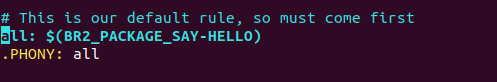

# Buildroot 

## Overview

Buildroot is a simple, efficient, and easy-to-use tool to generate embedded Linux systems through cross-compilation. This guide provides step-by-step instructions to install, build, and configure Buildroot for QEMU.


## Installation

1. **Clone Buildroot Repository:**
    ```bash
    git clone https://gitlab.com/buildroot.org/buildroot.git
    ```
    or **Download Buildroot latest release(long time support release):**
    ```bash
    wget https://buildroot.org/downloads/buildroot-2024.02.1.tar.gz
    ## extract and decompress
    tar -xzvf buildroot-2022.02.1.tar.gz
    ```
    
2. **Navigate to Buildroot Directory:**
    ```bash
    cd buildroot
    ```
    
3. **List all board configuration supported by Buildroot:**
    ```bash
    make list-defconfigs
    ```    
4. **load the default configuration of ARM Vexpress Cortex A9:**
    ```bash
    make qemu_arm_versatile_defconfig
    ```
    
5. **Configure Buildroot:**
    ```bash
    #  to customize Buildroot configuration. You can add/remove packages, modify kernel settings, etc.	
    make menuconfig
    ```

In the configuration, configure the following **requirement**:

- [x]  Init procecss to **System V** or **System D** or **Busybox init**

`In case of using systemD increase the root file system size from build root configuartion`

- [x]  Change **system host**
- [x] Change **system banner**
- [x]  Appy **root password**

#### Configure SSH

In order to configure SSH and add the executable in rootfs in **buildroot**

- [x]  Enable in **Network application** configure **dropbear**
- [x]  Set **Root password** in **system configuration**


6. **Build Buildroot:**
    ```bash
    #This command will start the build process. It will compile the toolchain, kernel, bootloader, and root filesystem.
    make
    ```
    
## Configuration

- **Customize Configuration:**
    Use `make menuconfig` to customize Buildroot configuration. You can add/remove packages, modify kernel settings, etc.


# Create Buildroot Package

Suppose you have a personalized package named "**SayHELLO**" that you want to add to your Root File System (Root FS) that you are creating with buildroot. In the simplest scenario, this package would include a source file and a makefile.

**For information about making personalized packages:** https://buildroot.org/downloads/manual/manual.html#adding-packages

1.  Create folder under package as following

```bash
mkdir  ./package/SayHELLO
```

2. Create source file under **APP** directory and write a simple code

```bash
vim sayHelloAPP.c
```

Inside the simple app write the following simple code

```c
#include <stdio.h>

int main(void)
{
        printf("Hello from buidroot\r\n");
        printf("Hello from buidroot\r\n");
        printf("Hello from buidroot\r\n");

        return 0;
}
```

3. we need to create the Makefile . Buildroot invokes the Makefile as part of the overall build process.
   
```bash
# under APP directory create Makefile
vim Makefile
```

Inside the Makefile write the following recipe
```makefile
# Just a simple package

CC := $(TARGET_CC)
CFLAGS := -I.

all: SayHelloAPP.c
        @$(CC)  -g -Wall $(CFLAGS) $(LDFLAGS) $< -o SayHelloAPP

clean:
        @rm -f SayHelloAPP

```

4. Create the configuration file that will be used by builroot to show the package in menuconfig
   
```bash
vim Config.in
```

Inside the file add the following configuration

```bash
config BR2_PACKAGE_SAY-HELLO
        bool "say-hello-app"
        help
          A package that display "hello from the buildroot".
```

5. Add the new Config.in in the configuration for buildroot

Under **package directory**

```bash
vim ./package/Config.in
```

6. Add the new Config.in in the configuration for buildroot

Under **package directory**
```bash
vim ./package/Config.in
```

Add new menu under Target Package

```bash
menu "APPs Packages"
        source "package/SayHELLO/Config.in"
endmenu
```

7. Create a package definition for this package in the buildroot source tree.

```
# under package/SayHELLO create the following Makefile
vim SayHELLO.mk
```

Add the following script inside the makefile

```makefile
################################################################################
#
# Say-Hello-APP package
#
################################################################################

SAYHELLO_VERSION := 1.0.0
SAYHELLO_SITE := package/SayHELLO/APP
SAYHELLO_SITE_METHOD := local
SAYHELLO_INSTALL_TARGET := YES

define SAYHELLO_BUILD_CMDS
        $(MAKE) CC="$(TARGET_CC)" LD="$(TARGET_LD)" -C $(@D) all
endef

define SAYHELLO_INSTALL_TARGET_CMDS
        $(INSTALL) -D -m 0755 $(@D)/SayHelloAPP $(TARGET_DIR)/usr/bin/SayHelloAPP
endef

define SAYHELLO_PERMISSIONS
        /usr/bin/SayHelloAPP f 4755 0 0 - - - - -
endef

$(eval $(generic-package))
```

8. Enable the package in buildroot menuconfig

```bash
# change directory to builroot
cd builroot
# configure the builroot
make menuconfig

# under target package you will find APPs Packages
# add it to the configuration
```

7. Build builroot again

After building the builroot, the execution file for SayHelloAPP will be add to the rootfs

```bash
# build the buildroot
make -j$(nproc)
```

**Note If APP doesn't appear on target:**

1. Make sure your package is enabled in the Buildroot configuration. You can do this by running make menuconfig and navigating to Package Selection for the target

2. Ensure that your package is included in the BR2_PACKAGE_HELLO variable in your Buildroot .config file. This file contains the configuration options for your Buildroot setup.

3. If your package is not automatically built and transferred to the target, you might need to add it explicitly as a dependency to the default target (all). You can do this by modifying the top-level Makefile in your Buildroot project. 




