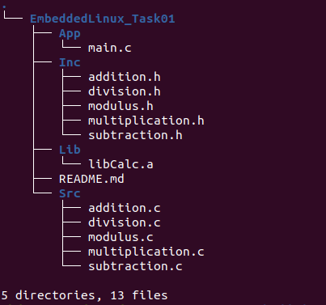

# Generating Output Using Source Files or Static Library

This project demonstrates how to generate output by compiling and linking source files or by using a static library.

## Project Tree

## Using Source Files:

1. Compile all source files into executable file:
    gcc App/main.c Src/* -o Calc

2. Run the executable:
    ./Calc

## Using Static Library:

1. Compile all source files into object files:
    cd Lib/
    gcc ../Src/* -c .

2. Generate static library from object files:
    ar rcs libCalc.a ./*

3. Link the static library with the main file to generate the output:
    cd ..
    gcc App/main.c Lib/libCalc.a -o Calc
    
4. Run the executable:
    ./Calc    
